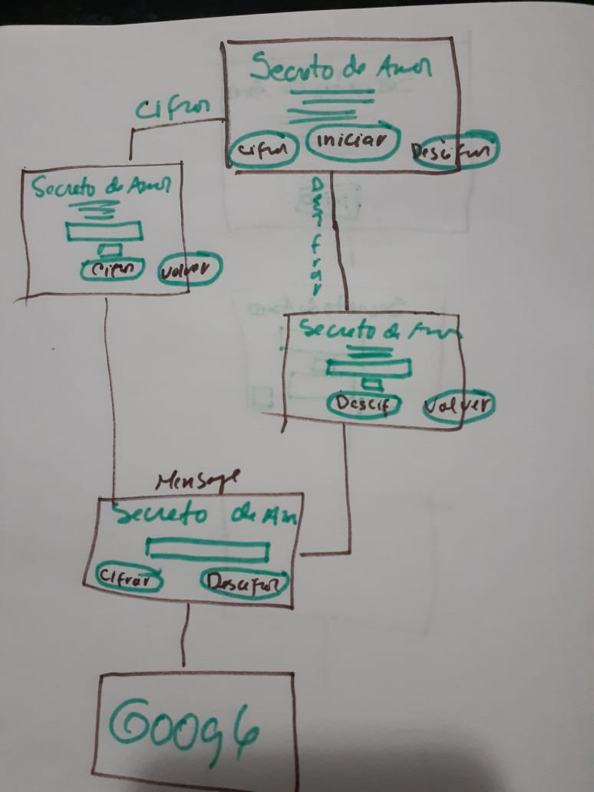
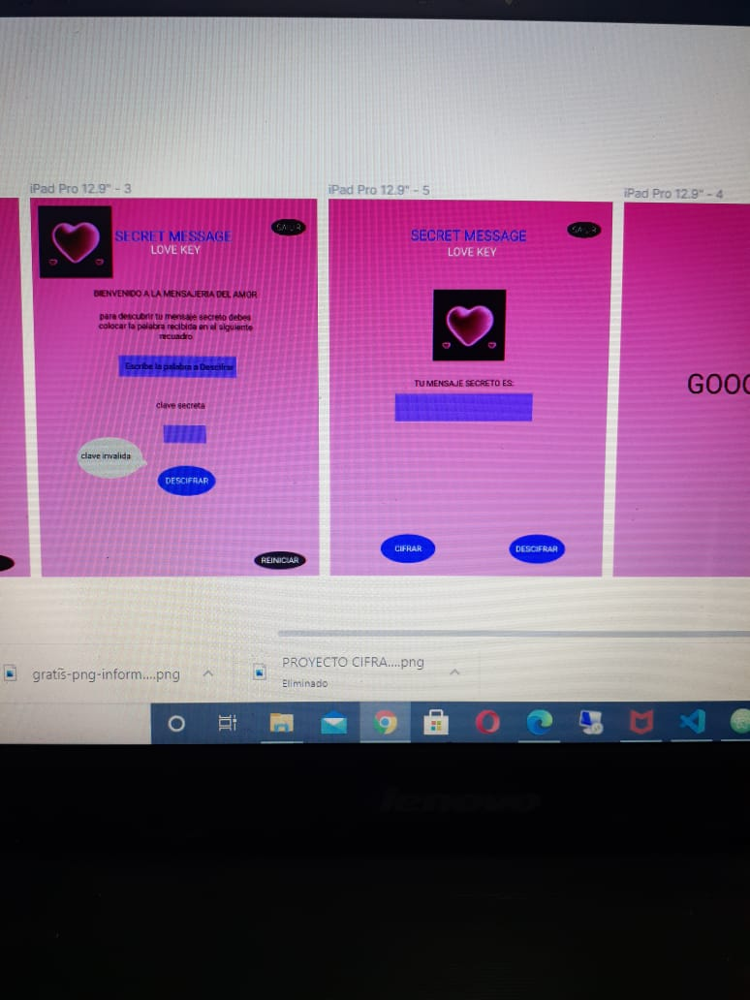
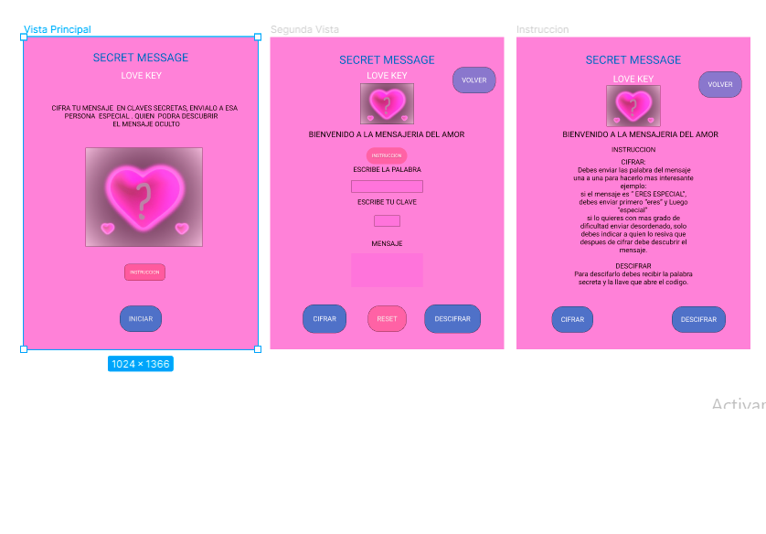

# 02/02/2021

## DESCARGA DE PROGRAMAS

Analice el proyecto sobre lo que se quiere:
# Descargar node.js
-descargas el programa Node.js 
-descargar la version 14.15.4lts le damos clic al boton WINDOW + R  y se abre una ventana donde 
-coloque "cmd" luego clic a aceptar y se abre la terminar.
# Instalar el node.js
 -dentro de la termina rebizar si tengo instalado  por ejemplo el node se coloca "node --version" o "node -v" y sale la version del node que tienes instalado. 
-igual se reviso si npm esta instalado "npm --version" 
-En caso de que no este instalado colocamos en la terminal colocamos "npm install npm".
# Buscar la ubicacion del archivo en la terminal
-Colocamos "dir" para buscar la direccion de la carpeta del proyecto. si no consigues el sitio donde esta la carpeta a trabajar colocas "cd" dar un espacio y arrastra el archivo a trabajar.
 -colocamos "cd nombre de la carpeta. ejemplo:           "cd desktop" para ir al escritorio.
 # Entrar a la carpeta del proyecto
 -colocamos "cd nombre de la carprta" para entra en la carpeta.
 # Clonar la carpeta
 -"git clone url de la carpeta en "gitHub" que esta en el repositorio remoto.
 # Instalar npm en terminal de visual
 -luego entra a Visual stude code entre a la terminal e intallamos el " npm install " automaticamente se abre la nueva file "node-modules"
 -luego " npm test " se abre automaticamente la file "coverage". 
 puedes hacer esto directamente dentro de la terminal  clocando "cd card validation " luego "npm install" y por ultimo "npm test"

## TEMA DEL PROYECTO

  es un programa pensado en aquellos usuarios timidos y no tan timidos que desean expresar sus sentimientos  a esa persona especial a traves de mensajes secretos,y no ser tan directos, creando motivacion y sosobra al receptor para descubrir el mensaje  recibido. 

 ## TIPO DE USUARIO

 va dirijido a usuarios mayores de edad, en particular a esos usuarios que les da temor hablar con esa persona especial y que a traves de este programa tendra la posibilidad de lograrlo sin estar presente. 

 ## NOMBRE DEL PROGRAMA:

 # "SECRET MASSAGE Love Key"

 ## PROTOTIPO:

 realice todos los requerimiento en un manuscrito para realizar el prototipo.

 

  luego lo plasme directamente en FIGMA con 6 vistas, escogi el color fucsia de fondo porque es un color romantico, lo combine con el azul y el negro por la parte masculina.

   

  # 03-02-2021

  Realice la experiencia de usuario con mi squad y de Ely sobre mi prototipo, resibí varios concejos que tome en consideración en la modificacion de mi proyecto:
  modifique los colores de:
  - la imagen 
  -los botones
  -el fondo de pantalla. 
 coregir la estructura del codigo html.

## utilizar Git Gash  Here

guarde mi primer commit del proyecto en la terminal "git " y lo hice de la siguiente manera:
 1- entre a la carpeta que contiene el proyecto.
  2-clic derecho y se abre una ventana 
  3-clic en "Git Bash Here" se abre la terminal
  4-en la terminal coloque "git status" para ver los cambios que realice(aparecen en rojo)
  5-coloque "git commit -m" para pasar los cambios al repositorio.
  6-le di "git a" y me envio a una ventana donde para poder escribir  pulse la tecla "i" luego coloque los cambios y le di "esc :wq" para salir de la ventana.

 # 04-02-2021

 termine el codigo html y css y buqueda de informacion sobre los codigos de javascript.
 surgio un error al explorar el codigo, recibi orientacion de Domi y se corrigio de la siguiente manera: colocando npm star en la terminal de visual studio code para poder abrir las vistas desde el localhost:5000 y si no quiere que siga corriendo el local colocamos el ctrl+c.
 05-02-2021 termine las modificaciones html y css.

 # 8-02-2021
 inicie la funcionalida del programa.

 # 9-2-2021

 ## PRIMER SPRINT
 presente los avances del proyecto y se me recomendo no usar function, si no la funcion arrow y hacer un solo html.
 
 realice las modificaciones recomendadas al figma y paso de seis vistas a tres.
  
  
 # 10-2-2021

 ## CODIFICAR APERTURA, CIERRE DE VISTAS y DINAMISMO

 -continue con las modificaciones de html y css,
 - busque la manera de abrir  cada pantalla por separado y descubri el <b>display:none </b>para cerrar la pantalla y <b>display: block;</b> para abrirla,
 -utilice div para englobar cada vista, pero no me funciono, ya que, tenia que hacer la funionalidad:  cuando una pantalla se abriera la otra se cerrara en el body. 
 -en mi squad me recomendaron que tenia que hacerlo desde el css. 
 -realice la modificacion: en el css. 
 -llame a los div de cada pantalla atraves de su clase,
 -coloque que la pantalla inicial comience abierta con un display: block; -
 -las demas pantallas iniciaran cerradas con  display:none .
 -Inicie la funcion del paso de una pantalla a la otra.
 -utilice la funcion arrow, obtener el elemento a traves del document.getElementById("id")y le aplique un escuchador de evento a traves del addEventListener. me ocurrio un problema, ya que, con la funcion tipo arrow el nombre de la funcion se transforma en una variable, pero lo logre resolver.

## CIFRADO Y DESCIFRADO

# 11-02-2021 

estuve leyendo sobre la funcionalidad de cifrado cesar, pero no logre implenetarlo en el proyecto.

# 12-2-2021

-trabaje fuera del proyecto para verificar la funcionaliadad de los metodos encode y decode,
-le aplique un alert cuando el usuario deje un campo u input vacio, lo hice a traves del condicional (if,else)-luego obtuve el valor del input con    ".value" -converti el string en mayuscula con ".toUpperCase()"
-converti el offset en numero con parseInt
-aplique un for o ciclo para recorrer cada letra del string
-aplique ".charCodeAt(i)" el codigo Ascii de cada letra
-aplique la formula del cifrado (codigoAscii+65-offset)%26+65;
-aplique "String.fromCharCode()" para obtener la letra del abcedario
-  .innerHTML+= para imprimir el resultado .

# 15-02-2021

la funcion cifrado me estava dando error y tome una seccion de ayuda con ely y pude resolver el problema (era por error de un signo) apoye a mis compañeras en algunas dudas sobre su proceso .

# 16-02-2021

se realizo el sprint. y tome en consideracion los concejos de mis compañeras y los voy a implementar en mi proyecto.

# 17-02-2021

tarbaje en el paso del codigo del cifrado y descifrado al proyecto  y daba un error  al imprimir, recibi la colaboracion de Domi para llegar a la solucion y pude aprender lo grandioso del console.log(), gracias a esta herramienta pude captar el error(faltaba un signo "=") y funciono. yupiii

# 18-02-2021
estuve leyendo para entender los test y me dicuenta que en la estructura del cipher.spec.js pude notar que en las pruebas   al colocar algunos valores me debe arrojar un typeError: 

comence a leer como provocar un error y descubri el "try catch" y lo implemente en el proyecto. 
Tambien descubri como hacer botones que se espanden en figma:
-primero escribimos el texto que va dentro del boton,
-presionamos la tecla para "mayuscula A",
-en el panel derecho buscamos" auto layout "alli le damos el tamaño al boton.
en fill le damos color.
- lo mas importante es que si cambias la palabra y es mas grande que la anterior estste boton se espande.
tambien le agregue el boton de reset para resetear el formulario y termi ne el figma.

# 19-02-2021
segui investigando sobre los test y con alluda de mi squad puede entender mas su funcionalidad.
realize el test y me surgio dos error: Empty block statement  no-empty, que aun no se como descifrar.